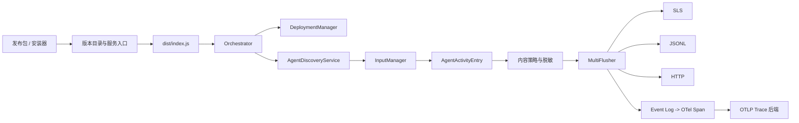
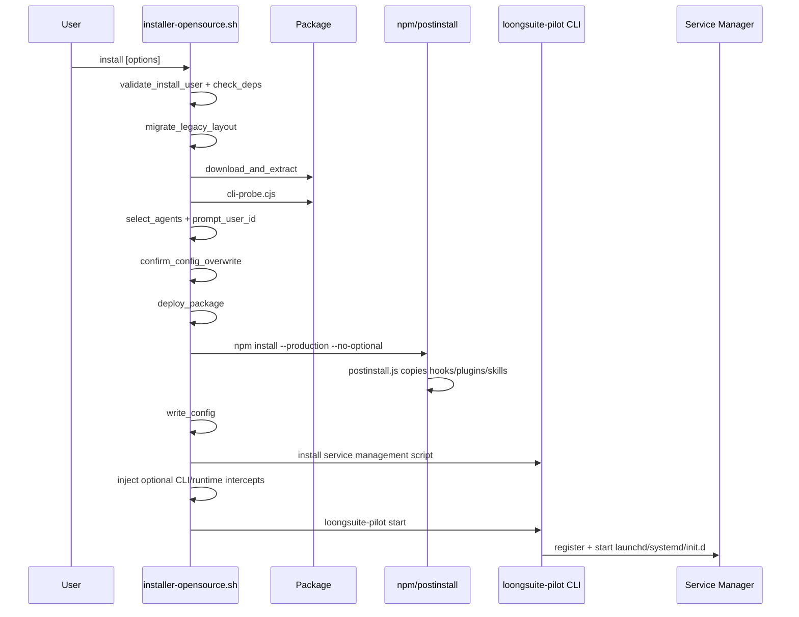
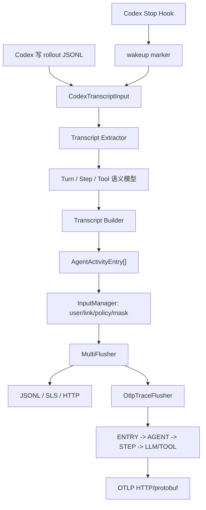

# LoongSuite Pilot 源码深度阅读指南

> 本文面向需要维护、扩展或排障 LoongSuite Pilot 的开发者，基于当前仓库源码整理安装、启动、模块边界和 Codex 端到端数据链路。
>
> 文中的行号以当前版本为准；代码演进后应优先按“文件 + 类/函数名”定位。

## 目录

1. [先建立正确的系统模型](#1-先建立正确的系统模型)
2. [推荐的源码阅读顺序](#2-推荐的源码阅读顺序)
3. [仓库和模块入口地图](#3-仓库和模块入口地图)
4. [构建和发布包生成](#4-构建和发布包生成)
5. [安装逻辑](#5-安装逻辑)
6. [启动逻辑](#6-启动逻辑)
7. [`Orchestrator.start()` 启动编排](#7-orchestratorstart-启动编排)
8. [通用数据处理链](#8-通用数据处理链)
9. [Codex 端到端深度解析](#9-codex-端到端深度解析)
10. [Codex Trace 是如何生成和导出的](#10-codex-trace-是如何生成和导出的)
11. [Codex 完整示例推演](#11-codex-完整示例推演)
12. [运行时状态与排障索引](#12-运行时状态与排障索引)
13. [测试如何帮助阅读源码](#13-测试如何帮助阅读源码)
14. [阅读时容易误判的旧代码和文档](#14-阅读时容易误判的旧代码和文档)
15. [修改某类功能时从哪里下手](#15-修改某类功能时从哪里下手)
16. [源码掌握验收题](#16-最短的源码掌握验收题)

## 1. 先建立正确的系统模型

LoongSuite Pilot 不是一个“Hook 收到事件后直接发 OTLP”的单层程序。它实际上包含四个相互独立但连续协作的阶段：

1. **安装与版本管理层**：构建发布包、安装 npm 生产依赖、部署多版本目录、写 `current` / `previous` 指针、注册系统服务。
2. **Agent 能力部署层**：读取 `agents.d/*.json`，检测本机 Agent，向 Agent 配置中注入 Hook 或插件。
3. **采集与事件标准化层**：从 Hook JSONL、SQLite、session transcript、API 或普通文件中读取源数据，生成统一的 `AgentActivityEntry`。
4. **输出层**：将同一批标准事件扇出到 SLS、JSONL、HTTP；若开启 Trace，再将事件转换为 OpenTelemetry span 并通过 OTLP 导出。



最重要的顶层源码入口是：

| 目的 | 第一入口 | 继续阅读 |
|------|----------|----------|
| 从源码直接运行 | [`src/index.ts`](../../src/index.ts) `main()` | [`src/core/orchestrator.ts`](../../src/core/orchestrator.ts) `Orchestrator.start()` |
| 理解已安装服务如何启动 | [`scripts/loongsuite-pilot.sh`](../../scripts/loongsuite-pilot.sh) `cmd_start()` / `cmd_run()` | [`scripts/collector-daemon.js`](../../scripts/collector-daemon.js) |
| 理解 Windows 启动 | [`scripts/loongsuite-pilot.ps1`](../../scripts/loongsuite-pilot.ps1) `Cmd-Start` / `Cmd-Run` | `Install-CollectorTask`、`collector-daemon.js` |
| 理解安装 | [`deploy/installer-opensource.sh`](../../deploy/installer-opensource.sh) `cmd_install()` | `deploy_package()`、`write_config()` |
| 理解发布包 | [`build.mjs`](../../build.mjs) | [`deploy/package-opensource.sh`](../../deploy/package-opensource.sh) |
| 理解 Agent 部署 | [`src/deployment/deployment-manager.ts`](../../src/deployment/deployment-manager.ts) | `agents.d/*.json` 与各 Strategy |
| 理解数据采集 | [`src/core/input-manager.ts`](../../src/core/input-manager.ts) | [`src/inputs/base/base-input.ts`](../../src/inputs/base/base-input.ts) 与具体 Input |
| 理解输出 | [`src/core/orchestrator.ts`](../../src/core/orchestrator.ts) `buildFlusher()` | [`src/flushers/`](../../src/flushers) |
| 理解 Codex | [`agents.d/codex.json`](../../agents.d/codex.json) | [`src/inputs/codex-transcript/`](../../src/inputs/codex-transcript) |

## 2. 推荐的源码阅读顺序

不要一开始逐目录顺序阅读。建议按调用链分七轮完成：

### 第一轮：只看进程入口和主干

1. [`package.json`](../../package.json)：确认 Node.js ESM 项目、`bin`、构建和测试命令。
2. [`src/index.ts`](../../src/index.ts)：看命令分流、配置加载、日志初始化、信号处理和 `Orchestrator` 创建。
3. [`src/core/orchestrator.ts`](../../src/core/orchestrator.ts)：先只读 `start()`、`stop()`、`buildFlusher()`、`registerAllInputs()`。
4. [`src/core/input-manager.ts`](../../src/core/input-manager.ts)：看事件如何进入统一输出链。

完成这一轮后，应能回答：“一个 Input 产生的 entry 最终如何被输出？”

### 第二轮：看安装和服务启动

1. [`build.mjs`](../../build.mjs)
2. [`deploy/package-opensource.sh`](../../deploy/package-opensource.sh)
3. [`deploy/installer-opensource.sh`](../../deploy/installer-opensource.sh) 或 Windows 对应的 `.ps1`
4. [`scripts/loongsuite-pilot.sh`](../../scripts/loongsuite-pilot.sh)
5. [`scripts/collector-daemon.js`](../../scripts/collector-daemon.js)

完成后，应能从用户执行安装命令一直追到 `dist/index.js`。

### 第三轮：看配置和声明式部署

1. [`src/core/config-loader.ts`](../../src/core/config-loader.ts)
2. [`src/types/index.ts`](../../src/types/index.ts)
3. [`src/types/deployment.ts`](../../src/types/deployment.ts)
4. [`src/deployment/agent-def-loader.ts`](../../src/deployment/agent-def-loader.ts)
5. [`src/deployment/deployment-manager.ts`](../../src/deployment/deployment-manager.ts)
6. [`src/deployment/hook-strategy.ts`](../../src/deployment/hook-strategy.ts)
7. 任意一个 [`agents.d/`](../../agents.d) 声明文件

### 第四轮：看 Input 生命周期和状态

1. [`src/inputs/base/base-input.ts`](../../src/inputs/base/base-input.ts)
2. [`src/core/agent-discovery-service.ts`](../../src/core/agent-discovery-service.ts)
3. [`src/checkpoints/state-store.ts`](../../src/checkpoints/state-store.ts)
4. `BaseHookInput`、`BaseSqliteInput`、`BaseSessionInput` 等特化基类
5. 选择一个具体 Input 沿 `collect()` 阅读

### 第五轮：看统一事件 Schema 和安全处理

1. [`src/types/events.ts`](../../src/types/events.ts)
2. [`src/normalization/entry-builder.ts`](../../src/normalization/entry-builder.ts)
3. [`src/normalization/normalize-messages.ts`](../../src/normalization/normalize-messages.ts)
4. [`src/normalization/agent-content-policy.ts`](../../src/normalization/agent-content-policy.ts)
5. [`src/mask/entry-masker.ts`](../../src/mask/entry-masker.ts)

### 第六轮：看输出与 Trace 转换

1. [`src/flushers/multi-flusher.ts`](../../src/flushers/multi-flusher.ts)
2. [`src/flushers/jsonl-flusher.ts`](../../src/flushers/jsonl-flusher.ts)
3. [`src/flushers/sls-flusher.ts`](../../src/flushers/sls-flusher.ts)
4. [`src/flushers/http-flusher.ts`](../../src/flushers/http-flusher.ts)
5. [`src/flushers/otlp-trace-flusher.ts`](../../src/flushers/otlp-trace-flusher.ts)

### 第七轮：再深入某个 Agent

以 Codex 为例，按以下顺序：

1. [`agents.d/codex.json`](../../agents.d/codex.json)
2. [`assets/hooks/codex-loongsuite-pilot-hook.sh`](../../assets/hooks/codex-loongsuite-pilot-hook.sh) / `.ps1`
3. [`assets/hooks/codex-hook-processor.mjs`](../../assets/hooks/codex-hook-processor.mjs)
4. [`src/inputs/codex-transcript/codex-transcript-input.ts`](../../src/inputs/codex-transcript/codex-transcript-input.ts)
5. [`src/inputs/codex-transcript/codex-transcript-extractor.ts`](../../src/inputs/codex-transcript/codex-transcript-extractor.ts)
6. [`src/inputs/codex-transcript/codex-transcript-builder.ts`](../../src/inputs/codex-transcript/codex-transcript-builder.ts)
7. `InputManager.handleEntries()`
8. `OtlpTraceFlusher.sendBatch()`

## 3. 仓库和模块入口地图

### 3.1 根目录

| 路径 | 作用 | 阅读入口 |
|------|------|----------|
| `src/` | Collector、Updater、CLI 的 TypeScript 源码 | `src/index.ts` |
| `agents.d/` | Agent 检测、部署、Hook、输入方式的声明 | `agents.d/codex.json` |
| `assets/hooks/` | 安装到用户目录后由各 Agent 调用的 Hook 脚本 | 各 `<agent>-hook-processor.mjs` |
| `assets/plugins/` | 通过配置注入的 Agent 插件 | `opencode/plugin.mjs`、`pi-coding-agent/index.mjs` |
| `deploy/` | 发布、安装、卸载脚本 | `installer-opensource.*` |
| `scripts/` | 安装后的服务管理、bootstrap daemon、辅助 CLI | `loongsuite-pilot.*` |
| `tests/` | 单元、集成、契约、E2E 和性能测试 | 与源码同名的测试目录 |
| `app/` | macOS 状态栏原生应用 | `app/macos-status-bar/` |
| `docs/` | 用户文档与本文 | `docs/zh-CN/README.md` |

### 3.2 `src/` 每个模块的入口

| 模块 | 职责 | 源码入口 | 关键后续文件 |
|------|------|----------|--------------|
| `core` | 顶层编排、配置、发现、准入、watchdog、保留策略 | [`core/orchestrator.ts`](../../src/core/orchestrator.ts) | `config-loader.ts`、`input-manager.ts`、`agent-discovery-service.ts` |
| `inputs` | 所有 Agent 数据源和采集基类 | [`inputs/base/base-input.ts`](../../src/inputs/base/base-input.ts) | `base-hook-input.ts`、各 Agent 子目录 |
| `deployment` | 加载 Agent 声明并部署 Hook / 插件 | [`deployment/deployment-manager.ts`](../../src/deployment/deployment-manager.ts) | `agent-def-loader.ts`、各 Strategy |
| `hooks` | 修改 Agent 配置文件中的 Hook 数组 | [`hooks/hook-manager.ts`](../../src/hooks/hook-manager.ts) | 被 `HookStrategy` 调用 |
| `normalization` | 构建统一事件、规范消息、内容策略、Git 和 span 属性 | [`normalization/entry-builder.ts`](../../src/normalization/entry-builder.ts) | `agent-content-policy.ts`、`global-attributes.ts` |
| `mask` | 按白名单字段对密钥类内容脱敏 | [`mask/entry-masker.ts`](../../src/mask/entry-masker.ts) | `rule-loader.ts`、`sensitive-rules.json` |
| `flushers` | SLS / JSONL / HTTP / OTLP 输出 | [`flushers/base-flusher.ts`](../../src/flushers/base-flusher.ts) | `multi-flusher.ts`、各具体 flusher |
| `checkpoints` | Input offset、高水位和去重状态 | [`checkpoints/state-store.ts`](../../src/checkpoints/state-store.ts) | `snapshot-store.ts` |
| `pipeline` | 独立文件采集和 Qoder API 管道 | [`pipeline/pipeline-manager.ts`](../../src/pipeline/pipeline-manager.ts) | `input/file/file-pipeline.ts`、`input/qoder-api/` |
| `updater` | manifest 检查、灰度选择、下载、部署和版本 GC | [`updater/index.ts`](../../src/updater/index.ts) | `updater.ts`、`version-utils.ts` |
| `metrics` | 数据流计数、周期状态和告警 | [`metrics/metrics-writer.ts`](../../src/metrics/metrics-writer.ts) | `metrics-collector.ts`、`alarm-manager.ts` |
| `internal` | 内部状态/告警发送和 WebTracking 公共实现 | [`internal/sender.ts`](../../src/internal/sender.ts) | `statistic.ts`、`webtracking-post.ts` |
| `status-bar` | 运行时快照、摘要、macOS 状态栏进程 | [`status-bar/index.ts`](../../src/status-bar/index.ts) | 三个 writer/manager |
| `local-workers` | 本地远控 worker 实例的连接、启停、CLI | [`local-workers/worker-cli.ts`](../../src/local-workers/worker-cli.ts) | `instance-store.ts`、`local-worker-activation-service.ts` |
| `cli` | Collector 进程内的辅助命令 | [`cli/token-usage.ts`](../../src/cli/token-usage.ts) | 由 `src/index.ts` 动态导入 |
| `types` | 事件、配置、部署、ClientType 类型 | [`types/index.ts`](../../src/types/index.ts) | `events.ts`、`deployment.ts`、`client-type.ts` |
| `utils` | 文件、日志、时间、进程、Git、网络工具 | [`utils/fs-utils.ts`](../../src/utils/fs-utils.ts) | 按调用方选择阅读 |

> 当前仓库没有导航旧文档中所写的 `src/file-collection/`。独立文件采集已经迁移到 `src/pipeline/input/file/` 和 `src/pipeline/flusher/file/`。

### 3.3 当前 Agent 声明与实际部署方式

当前 `agents.d/*.json` 是事实来源，不应仅依赖旧架构表：

| Agent | 声明 | 当前 `deployMode` | 主要数据入口 |
|-------|------|------------------|--------------|
| Claude Code | `claude-code.json` | `hook` | `ClaudeCodeLogInput` |
| Codex | `codex.json` | `hook` | `CodexTranscriptInput` |
| Cursor | `cursor.json` | `hook` | `CursorHookInput` |
| Cursor CLI | `cursor-cli.json` | `hook` | 声明式 Hook |
| Kiro CLI | `kiro-cli.json` | `hook` | Hook JSONL + session polling |
| OpenCode | `opencode.json` | `plugin-inject` | `OpenCodeLogInput` |
| Pi Coding Agent | `pi-coding-agent.json` | `plugin-inject` | `PiCodingAgentLogInput` |
| Qoder / Qoder CN / Work | 对应 `qoder*.json` | `hook` | IDE、SQLite、Hook、session、trace 多输入互斥 |
| Qwen Code CLI | `qwen-code-cli.json` | `hook` | `QwenCodeCliLogInput` |
| Qoder JetBrains | `qoder-jetbrains.json` | `detection-only` | 仅检测 |
| Wukong | 无内置声明 | 无部署 | `WukongInput` API polling |

## 4. 构建和发布包生成

### 4.1 TypeScript 构建

[`build.mjs`](../../build.mjs) 使用 esbuild 生成三个运行入口：

| 源入口 | 构建产物 | 用途 |
|--------|----------|------|
| `src/index.ts` | `dist/index.js` | Collector 主进程和 npm CLI |
| `src/cli-probe.ts` | `dist/cli-probe.cjs` | 安装阶段检测本机 Agent |
| `src/updater/index.ts` | `dist/updater/index.js` | 独立自动更新进程 |

构建细节：

- Node 平台，ES2022。
- Collector / Updater 产物为 ESM；probe 为 CJS，便于安装器直接执行。
- 项目源码被 bundle，但 npm 依赖保持 external，因此安装目录仍需要 `npm install --production`。
- 开源模式通过 `internalStubPlugin` 将 `.internal` 告警/统计实现替换为空实现。
- `sensitive-rules.json` 复制到 `dist/`。
- macOS 构建时会 best-effort 编译状态栏应用，失败不阻断主构建。

### 4.2 发布包组装

[`deploy/package-opensource.sh`](../../deploy/package-opensource.sh) 的顺序是：

1. 删除旧 `dist/` 并执行 `npm run build`；`--skip-build` 可复用已有产物。
2. 创建临时 staging 目录。
3. 从 `package.json.version` 和 Git 生成 `VERSION`：`version`、`git_commit`、`git_branch`、`build_time`。
4. 将 `dist/`、`assets/`、`scripts/`、`agents.d/`、package metadata 放入 `loongsuite-pilot/`。
5. 若存在预构建插件 tarball 和 macOS 状态栏文件，一并打包。
6. 设置 Shell/Hook 脚本执行权限。
7. 开源包删除内部迁移脚本和 `scripts/updater-daemon.js`。
8. 同时生成 Linux/macOS 使用的 `.tar.gz` 和 Windows 使用的 `.zip`。

这里有一个重要边界：**发布包不包含 `node_modules`**，依赖是在目标机器安装阶段下载和构建的。

## 5. 安装逻辑

### 5.1 安装涉及的目录

默认情况下，程序文件、数据文件和版本指针共享 `~/.loongsuite-pilot`：

```text
~/.loongsuite-pilot/
├── bin/                         # 稳定 bootstrap，不随 current 指针直接变化
│   ├── collector-daemon.js
│   └── updater-daemon.js        # 开源包通常不含
├── versions/
│   ├── <version>_<commit>/      # 完整发布包 + node_modules
│   └── ...
├── current                      # 当前版本目录名
├── previous                     # 上一版本目录名
├── config.json
├── node-bin                     # 安装时选定的 Node 可执行文件
├── hooks/                       # postinstall 复制的 Hook 运行文件
├── plugins/
├── skills/
├── logs/
├── state/
├── deployed-agents.json
└── agent-control.json
```

命令入口安装到：

- Linux/macOS：`~/.local/bin/loongsuite-pilot`，可写时再链接到 `/usr/local/bin/loongsuite-pilot`。
- Windows：`~/.local/bin/loongsuite-pilot.ps1` 和 `.cmd` shim，并修改用户 PATH。

### 5.2 Linux/macOS 首次安装时序

主入口是 [`deploy/installer-opensource.sh`](../../deploy/installer-opensource.sh) `cmd_install()`（约 1449 行）：



各阶段的源码含义如下。

#### 1. 参数和依赖解析

- 无子命令时默认为 `install`。
- 支持 SLS、CMS、Trace/Log 开关、Agent 选择、脱敏、版本和 package URL 参数。
- `resolve_node()` 按 nvm、Volta、fnm、Homebrew、系统 PATH 等顺序选择 Node.js。
- 要求 Node.js `>= 18`，并把绝对路径写入 `~/.loongsuite-pilot/node-bin`。Hook 和服务以后优先复用这个 Node，避免登录 shell 与后台服务 PATH 不一致。
- npm 尽量从同一 Node 安装目录解析。

#### 2. 下载和解压

`download_and_extract()`：

- 默认 URL 为 OSS 的 `latest/loongsuite-pilot.tar.gz`；指定 `--version` 后使用版本路径。
- 下载到 `mktemp` 目录。
- 优先识别顶层 `loongsuite-pilot/`，否则寻找 `package.json`。
- 临时目录由 `trap` 清理。

#### 3. Agent 探测和选择

`probe_agents()` 执行发布包中的 `dist/cli-probe.cjs`。其源码入口为 [`src/cli-probe.ts`](../../src/cli-probe.ts)：

- 用 `AgentDefLoader` 同时加载内置 `agents.d` 和本地覆盖 `agents.d.local`。
- 对每份声明运行 `detectAgent()`，检查路径和命令。
- 交互安装显示列表；非交互安装默认选中所有已检测 Agent。
- 选择结果写入 `config.json -> agents.<id>.enabled`。

#### 4. 多版本部署

`deploy_package()`（约 567 行）：

1. 从 `VERSION` 读取版本和 commit。
2. 目标目录名为 `<version>_<commit>`。
3. 若已有 `current` 且不同，将旧值写入 `previous`。
4. 将解压目录复制到 `versions/<version>_<commit>/`。
5. 通过 `current.tmp` + rename 原子更新 `current`。
6. 将 `collector-daemon.js` 复制到稳定的 `~/.loongsuite-pilot/bin/`。
7. 在版本目录执行生产依赖安装。

旧的单目录 `~/.loongsuite-pilot/package` 会被 `migrate_legacy_layout()` 迁入 `versions/`。

#### 5. postinstall 资产部署

[`scripts/postinstall.js`](../../scripts/postinstall.js) 会：

- 递归复制 `assets/hooks/` 到数据根目录下的 `hooks/`。
- 给 `.sh` / `.ps1` 设置可执行权限。
- 复制 `assets/skills/` 和 `assets/plugins/`。
- 写入旧 Claude preload 路径的 no-op stub，防止旧终端残留 `NODE_OPTIONS` 导致模块找不到。
- 以 fail-open 方式运行可选配置迁移。

这一步只是把 Hook **文件**放到 Pilot 数据目录；把 Hook **配置项**写进 Codex、Claude、Cursor 等工具配置，是 Collector 启动后的 `DeploymentManager.deployAll()` 完成的。

#### 6. 配置合并

`write_config()`（约 669 行）读取旧配置后合并：

- 强制 `enabled: true`，设置 `dataDir`。
- 迁移 `user.id` 到 `userId`。
- 仅在安装参数给出时覆盖 SLS、CMS、`collectLog`、`collectTrace`、`serviceNamePrefix`、mask 等字段。
- 将本次 Agent 选择写入 `agents`。
- 保留未涉及的已有配置。
- 对关键字段发生变化时，交互模式会先确认；非交互模式继续覆盖。

#### 7. 服务命令和额外注入

`install_loongsuite_pilot_command()` 复制当前版本中的服务管理脚本到稳定 PATH。随后安装器还会按平台 best-effort 注入：

- Qoder CLI token intercept。
- Qoder Work runtime wrapper。
- Claude Code fetch intercept。

这些是特定 Agent 的补充采集手段，不属于 Collector 主进程启动。

#### 8. 启动与健康检查

安装器执行 `loongsuite-pilot start`，两秒后通过 `status` 文本判断服务是否已运行。启动失败通常不会删除已经部署的首次安装版本，而是提示用户检查状态。

### 5.3 Windows 安装差异

入口为 [`deploy/installer-opensource.ps1`](../../deploy/installer-opensource.ps1) `Cmd-Install`：

- 下载 zip 并通过 `Expand-Archive` 解压。
- Node 解析兼容 nvm-windows、fnm、Volta、Program Files 和 PATH。
- 版本目录、`current` / `previous`、npm 生产依赖和配置合并与 Shell 版一致。
- 安装 `.ps1` 管理脚本和 `.cmd` 转发器。
- 服务由 Windows Task Scheduler 承担，而不是 Windows Service。
- Task 注册优先 S4U，失败后回退 Interactive principal；任务按用户身份命名，避免多用户冲突。
- Collector 任务在登录时启动，并每 5 分钟触发一次 watchdog；`MultipleInstances=IgnoreNew` 防止重复进程。
- VBScript + `wscript.exe` 用于隐藏控制台窗口，并用 UTF-16 写文件以兼容非 ASCII 用户目录。

### 5.4 升级、回滚和 GC

手工升级入口为安装器的 `cmd_upgrade()` / `Cmd-Upgrade`：

1. 必须已有安装。
2. 下载并比较新旧 `version + git_commit`。
3. 停止服务。
4. 将新版本部署到新的版本目录，原版本不修改。
5. `current` 指向新版本，`previous` 指向旧版本。
6. 启动并检查新版本。
7. 成功后删除 `current` / `previous` 之外的旧版本。
8. 失败时调用 `loongsuite-pilot rollback` 恢复指针并重启。

自动更新是独立进程：[`src/updater/index.ts`](../../src/updater/index.ts) 创建 [`Updater`](../../src/updater/updater.ts)。它读取 manifest，支持稳定/灰度目标选择、SHA-256 校验、指数退避、版本目录部署、原子指针更新、Collector 单独重启和旧版本 GC。

开源打包脚本会移除 `scripts/updater-daemon.js`；而 `buildAutoUpdateConfig()` 也只有在配置了 package URL 时才启用自动更新。因此默认开源安装通常只有 Collector 服务。

### 5.5 卸载逻辑和当前注意点

卸载会停止服务、移除自启动、清理 Hook/插件配置、删除命令入口，并尝试清理历史 OTel 插件残留。

当前源码存在一个必须注意的行为：

- Shell 版 `cmd_uninstall()` 在判断 `--purge` 前执行 `rm -rf "$HOME/.loongsuite-pilot"`。
- Windows `Cmd-Uninstall` 同样先删除 `%USERPROFILE%\.loongsuite-pilot`。
- 默认 `dataDir` 恰好就是该目录，所以“不加 purge 保留配置和日志”的提示与默认路径下的实际删除行为不一致。
- 只有将 `dataDir` 自定义到安装根目录之外时，非 purge 才可能真正保留数据。

另一个边界是：安装包版本目录固定放在 `~/.loongsuite-pilot/versions`，但 `--data-dir` 可以把运行数据改到别处。`postinstall.js` 只读取环境变量 `LOONGSUITE_PILOT_DATA_DIR`，安装器内部的 `DATA_DIR` 变量不会自动变成该环境变量；自定义数据目录时需要重点验证 Hook 资产是否确实复制到了声明中 `$PILOT_DATA/hooks` 指向的位置。

## 6. 启动逻辑

### 6.1 已安装环境的完整启动链

Linux/macOS：

```text
loongsuite-pilot start
  -> scripts/loongsuite-pilot.sh:cmd_start()
  -> autostart_install()
  -> launchd / systemd-user / systemd-system / init.d
  -> loongsuite-pilot run
  -> cmd_run()
  -> ~/.loongsuite-pilot/bin/collector-daemon.js
  -> ~/.loongsuite-pilot/versions/$(current)/dist/index.js
  -> src/index.ts:main()
  -> loadConfig()
  -> new Orchestrator(config).start()
```

Windows：

```text
loongsuite-pilot.cmd start
  -> powershell loongsuite-pilot.ps1 Cmd-Start
  -> Install-CollectorTask + Start-ScheduledTask
  -> wscript hidden launcher
  -> node ~/.loongsuite-pilot/bin/collector-daemon.js
  -> current/dist/index.js
  -> src/index.ts:main()
```

### 6.2 服务管理脚本

[`scripts/loongsuite-pilot.sh`](../../scripts/loongsuite-pilot.sh) 的关键职责不是业务采集，而是保持一个稳定的系统服务入口：

- `resolve_current_version()`：读取 `current`，验证对应目录；失败时兼容旧 `package/dist/index.js`。
- `cmd_start()`：检测 PID，选择并注册自启动管理器。
- `cmd_run()`：前台运行模式，供系统服务调用；写 PID、设置 `AGENT_DATA_COLLECTION_CONFIG`，然后 `exec` bootstrap。
- `cmd_stop()`：移除自启动、发送 SIGTERM、等待退出，必要时 SIGKILL，并清理遗留进程。
- `cmd_restart_collector()`：Updater 部署后只切换 Collector，不让 Updater 杀死自身。
- `cmd_rollback()`：交换/恢复版本指针并重启。
- `status` / `info` / `log`：运行诊断。

Linux 初始化系统选择集中在 `detect_init_system()` 和 `autostart_install()`：

| 平台/条件 | 服务方式 | 关键配置 |
|-----------|----------|----------|
| macOS | launchd | `~/Library/LaunchAgents/com.loongsuite-pilot.plist`，`RunAtLoad` + 失败保活 |
| Linux，有用户 systemd session | systemd user | `~/.config/systemd/user/loongsuite-pilot.service` |
| Linux，可提权 | systemd system | `/etc/systemd/system/loongsuite-pilot-<user>.service` |
| 无 systemd 但支持传统 init | init.d | `/etc/init.d/loongsuite-pilot-<user>` |

各服务最终都执行 `loongsuite-pilot run`，因此业务入口不会因服务管理器不同而分叉。

### 6.3 Bootstrap daemon 为什么独立于版本目录

[`scripts/collector-daemon.js`](../../scripts/collector-daemon.js) 只有一个目标：在每次进程启动时动态读取版本指针。

1. 读取 `current`。
2. 检查 `versions/<name>/dist/index.js`。
3. 当前版本无效时尝试 `previous`。
4. 通过动态 `import()` 加载实际 Collector。
5. 如果 ESM 模块图加载阶段就失败，在业务 `main()` 尚未来得及执行前写 `last-startup-crash.json`。

因此 systemd / launchd / Task Scheduler 永远指向稳定的 bootstrap 文件；升级只需原子切换文本指针，不必反复改系统服务配置。

### 6.4 `src/index.ts` 进程入口

[`src/index.ts`](../../src/index.ts) 的 `main()` 顺序如下：

1. 先解析 worker 子命令，交给 `handleWorkerCli()`。
2. `token-usage` / `tokens` 动态加载 TUI 命令。
3. 调用 `loadConfig()`。
4. 将 `dataDir` 展开为绝对路径，初始化 `logs/loongsuite-pilot-service.log`。
5. 若 `config.enabled=false`，清理旧 crash breadcrumb 后正常退出。
6. 创建 `Orchestrator`。
7. 注册 SIGINT / SIGTERM，收到信号后顺序执行 `orchestrator.stop()`。
8. 等待 `orchestrator.start()` 完成。
9. 进入健康状态后清理旧启动失败 breadcrumb。

顶层异常会记录 `phase=startup` 的 crash breadcrumb 并退出码 1；bootstrap 捕获的是更早的 `phase=module_load` 异常。两层配合可区分“依赖/模块加载失败”和“业务初始化失败”。

### 6.5 配置加载优先级

[`src/core/config-loader.ts`](../../src/core/config-loader.ts) `loadConfig()` 明确采用：

```text
环境变量 > config.json > 内置默认值
```

- 配置文件路径：`AGENT_DATA_COLLECTION_CONFIG`，默认 `~/.loongsuite-pilot/config.json`。
- 数据目录：`LOONGSUITE_PILOT_DATA_DIR` > `config.dataDir` > 默认目录。
- `userId`：环境变量 > `userId` > 兼容字段 `user.id` > hostname。
- `collectLog`、`collectTrace` 分别控制日志/Trace 的部分输出逻辑。
- 内置/托管后端从 `<dataDir>/configs/inner/data_config.json` 加载。
- `listeners` 控制具体 Input，而 `agents` 控制 Agent 总开关和消息内容策略。

Codex 当前 listener key 是 `codex-transcript`。如果新 key 未配置，加载器会兼容旧的 `codex-log` 或 `codex-aborted-turn` 配置。

一个容易误解的默认值是：JSONL flusher 默认启用。`Orchestrator.buildFlusher()` 只用 `collectLog !== false` 直接门控 SLS；JSONL 仍按自己的 `jsonl.enabled` 决定。因此需要完全关闭本地事件日志时，应显式设置 `jsonl.enabled=false`，不能只依赖 `collectLog=false`。

## 7. `Orchestrator.start()` 启动编排

[`src/core/orchestrator.ts`](../../src/core/orchestrator.ts) 是唯一顶层业务编排器。当前 `start()` 的真实顺序如下。

### 阶段 1：准备目录和持久化状态

- 创建数据根目录和 `logs/`。
- 清理遗留 `.tmp` 文件。
- 创建并加载 `StateStore(logs/input-state.json)`。
- 加载 `AgentControlManager(agent-control.json)`。

`agents.<id>.enabled` 是配置层总开关，`agent-control.json` 的 `on/off/auto` 是本地运行时准入层；两者都通过时相应 Input 才能启动。

### 阶段 2：创建输出链

`buildFlusher()` 按配置创建：

1. SLS，且 `collectLog !== false`。
2. JSONL。
3. HTTP。
4. OTLP Trace，且 `collectTrace=true` 并成功解析到至少一个 endpoint。

每个 flusher 启动失败会记录警告，尽量不影响其他输出。若一个都没有，自动创建 JSONL fallback。多于一个时用 `MultiFlusher` 并行扇出。

### 阶段 3：创建 `InputManager` 和通用处理策略

向 `InputManager` 注入：

- flusher
- 安装配置的 `userId`
- Agent 内容采集策略
- AlarmManager
- mask 配置和已编译规则
- 可选 TraceLinker

### 阶段 4：可选上游 Trace 关联

当 `upstreamLink.enabled=true`：

- `CorrelationStore` 读取 `<dataDir>/acp-correlate/<session>.jsonl`。
- `TraceLinker` 在 `other` 用户输入事件到达时按 prompt hash/prefix 关联 `traceparent`。
- 关联成功后覆盖采集侧生成的 `trace_id`，并把上游 span id 写给根用户输入事件。
- session 级 env 关联只用于该 session 第一 turn；turn 级 adapter 记录优先。
- 任何错误均 fail-open。

### 阶段 5：部署 Agent 采集能力

创建 `DeploymentManager(dataDir, pilotDir)` 并执行 `deployAll()`：

1. 清理旧版插件残留。
2. 加载内置 `agents.d` 与 `<dataDir>/agents.d.local`；本地同 ID 声明覆盖内置声明。
3. 读取 `deployed-agents.json`。
4. 对每个声明检测 Agent 是否存在。
5. 选择 hook / plugin-probe / plugin-inject / detection-only Strategy。
6. 判断是否需要部署，执行并记录状态。

部署是 best-effort：一个 Agent 失败不会阻断其他 Agent 或 Collector 启动。

### 阶段 6：注册全部 Input

`registerAllInputs()` 直接实例化具体 Input，注册到 `InputManager`，再构造对应 `AgentDetectionEntry`。

Qoder 系列有多种输入源，方法中包含显式互斥条件；例如优先 trace input，禁用时才启用 SQLite 或 Hook fallback。Codex 当前只注册统一的 `CodexTranscriptInput`。

### 阶段 7：动态发现

`AgentDiscoveryService` 同时持有两类 detection entry：

- Input entry：Agent 可用时启动 Input，不可用或被禁用时停止。
- `deploy:<agent>` entry：安装 Collector 后才出现的新 Agent 会被动态发现并部署 Hook/插件。

它优先对 watch path 使用 `fs.watch`，失败时按 entry 周期轮询；全局还每 5 分钟 refresh。状态机是 `idle -> starting -> running -> stopping -> idle`。

### 阶段 8-14：后台服务

随后依次启动：

| 顺序 | 服务 | 作用 |
|------|------|------|
| 8 | Agent discovery 本身 | 首轮 availability 检查并启动 Input |
| 9 | `LogRetentionService` | 定期清理 Hook history/error/debug、output、失败日志 |
| 10 | `HookWatchdog` | 恢复被其他工具覆盖的 Hook/插件注入 |
| 11 | `UpdaterWatchdog` | 自动更新开启时检查 Updater 进程与 heartbeat |
| 12 | `PipelineManager` | 可选文件/Qoder API 独立采集管道 |
| 13 | `MetricsWriter` | 周期写数据流指标和告警 |
| 14 | status bar 支撑 | 写 runtime/summary，并在 macOS 启动原生状态栏 app |

最后设置 `isRunning=true` 并触发 `started`。`stop()` 基本按逆依赖顺序停止服务、等待 Input 队列排空、shutdown flusher，最后保存 state。

## 8. 通用数据处理链

### 8.1 Input 生命周期

[`src/inputs/base/base-input.ts`](../../src/inputs/base/base-input.ts) 保证：

- `start()` 先调用 `onStart()`，立即采集一轮，再启动 interval。
- 同一个 Input 的采集周期串行；已有 `cyclePromise` 时复用，避免重入。
- `stop()` 清 timer、等待当前采集完成，再调用 `onStop()`。
- `collect()` 返回非空 entries 时触发 `entries` 事件。
- 每轮结束保存 `StateStore`。
- watch 型 Input 可调用 `requestCollection()` 触发即时但仍串行的采集。

### 8.2 `InputManager` 的批次处理顺序

每个 Input 有独立 Promise 队列，避免同一输入的多个 `entries` batch 并发修改顺序。`handleEntries()` 的处理顺序是：

1. 更新输入计数、字节数和活跃时间。
2. 注入 `user.id`：显式配置值具有最高优先级。
3. 可选 `TraceLinker.stamp()`。
4. `applyAgentContentPolicy()`：按 Agent 决定是否删除 prompt、response、工具参数/结果、system instructions 等内容字段。
5. `maskAgentActivityEntry()`：仅对允许脱敏的字段递归应用密钥规则。
6. `flusher.sendBatch()`。

这意味着内容关闭发生在脱敏之前；被内容策略删除的字段不会到达任何输出。mask 对剩余字段生效，所有 flusher 接收同一份处理后的 entry。

### 8.3 统一事件结构

[`src/types/events.ts`](../../src/types/events.ts) 的 `AgentActivityEntry` 使用 dotted keys，核心事件有：

- `other`
- `llm.request`
- `llm.response`
- `tool.call`
- `tool.result`
- `skill.use`
- `tool.approve`

[`buildAgentActivityEntry()`](../../src/normalization/entry-builder.ts) 负责：

- 生成/规范 `time_unix_nano`、`observed_time_unix_nano`、`event.id`。
- 将旧别名字段映射为 `gen_ai.*`。
- 规范消息 role/part 结构。
- 推断 provider。
- 将 attributes 展平为 `agent.*`。
- 移除旧别名。

日志型输出调用 `serialiseLogEntry()` 将 number、boolean、array/object 统一转为字符串，适配 SLS 宽表和 JSONL 契约。

### 8.4 输出语义差异

| 输出 | 缓冲 | 序列化 | 失败行为 |
|------|------|--------|----------|
| JSONL | 无，逐行写 | 所有值变字符串；默认丢弃 `agent.<namespace>.*` | 写文件异常向上返回 |
| SLS | 按 endpoint/agent 分桶，默认 2 秒 | 字符串列；默认丢弃 agent scoped 字段 | 指数重试，失败元数据持久化并告警 |
| HTTP | 按条数/时间缓冲 | 字符串列，但保留 agent scoped 字段 | 失败 batch 放回队首 |
| OTLP Trace | 按 turn 缓冲 | 事件先转 OTel span | endpoint 隔离，失败 span 写 `otlp-failed` |

`MultiFlusher` 使用 `Promise.allSettled`，某个输出失败不会阻断其他输出；同时它会记录失败，但通常不会把单个下游失败重新抛给 `InputManager`。

## 9. Codex 端到端深度解析

### 9.1 当前实现结论

Codex 当前采用“**Stop Hook 唤醒 + rollout transcript 为唯一数据事实源**”的模型：



正常完成和用户中断都由同一个 `CodexTranscriptInput` 处理。旧的 `CodexLogInput` 和 `CodexAbortedTurnInput` 仍保留源码、导出和测试，但 `Orchestrator.registerAllInputs()` 已不再注册它们。

### 9.2 Codex 声明如何部署

[`agents.d/codex.json`](../../agents.d/codex.json) 当前关键配置是：

```json
{
  "id": "codex",
  "deployMode": "hook",
  "detection": { "paths": ["~/.codex"] },
  "hook": {
    "settingsPath": "~/.codex/hooks.json",
    "events": ["Stop"],
    "retiredEvents": [
      "SessionStart",
      "UserPromptSubmit",
      "PreToolUse",
      "PostToolUse",
      "PostToolUseFailure"
    ],
    "hookCommand": "$PILOT_DATA/hooks/codex-loongsuite-pilot-hook.sh",
    "format": "nested",
    "eventSubcommand": "kebab-case"
  },
  "input": { "type": "session-file-polling" }
}
```

Collector 启动时的部署链：

1. `AgentDefLoader.resolveString()` 将 `$PILOT_DATA` 展开成实际数据目录；Windows 将 `.sh` 替换为 `.ps1`。
2. `DeploymentManager` 检测 `~/.codex` 是否存在。
3. `HookStrategy.needsDeploy()` 检查目标 Hook 是否存在、旧事件是否仍残留、Codex `hooks.json` 是否错误地带有 `version` 字段。
4. `HookStrategy.deploy()` 删除 retired events 下 Pilot 管理的旧 Hook。
5. `HookManager.installHook()` 向 `hooks.Stop` 写 nested entry：`{matcher:"*", hooks:[{command,type:"command"}]}`。
6. `eventSubcommand=kebab-case` 使实际 command 末尾带 `stop`。
7. `replaceHookCommands` 删除老 `otel-codex-hook` / `.cache/opentelemetry.instrumentation.codex` 命令。
8. `writeCodexTrust()` 回读 Hook 在数组中的真实 group index，并向 `~/.codex/config.toml` 写 trust hash。

Codex trust hash 实现在 [`src/deployment/codex-trust-writer.ts`](../../src/deployment/codex-trust-writer.ts)：

- identity 包含规范化 event name 和精确 command。
- 计算 canonical JSON 的 SHA-256，写成 `sha256:<hex>`。
- trust key 包含 `hooks.json` 绝对路径、event 和真实 group index。
- 写后立即 `verifyTrustHashes()` 自校验。
- `LOONGSUITE_PILOT_CODEX_FORCE_BYPASS=1` 是应急跳过信任校验的通道，不应作为常规配置。
- Codex Desktop 仍可能要求用户在 UI 首次手动信任。

`HookWatchdog` 会每 5 分钟检查 Hook marker；若 Codex 或其他工具覆盖配置，调用 `deploySingle()` 自愈，并受 repair cooldown 限制。

### 9.3 Stop Hook 实际做什么

平台入口：

- [`assets/hooks/codex-loongsuite-pilot-hook.sh`](../../assets/hooks/codex-loongsuite-pilot-hook.sh)
- [`assets/hooks/codex-loongsuite-pilot-hook.ps1`](../../assets/hooks/codex-loongsuite-pilot-hook.ps1)

二者都遵循 fail-open：

- stdin 不是重定向输入时直接输出 `{}`。
- 优先使用安装器 pin 的 Node.js，找不到 Node/processor 时记录错误但退出 0。
- Windows 以 raw bytes 转发 stdin，兼容 BOM 和中文编码问题。
- Processor 无论成功失败都不得阻断 Codex。

[`assets/hooks/codex-hook-processor.mjs`](../../assets/hooks/codex-hook-processor.mjs) **不解析 transcript，也不写遥测 JSONL**。`stop` 子命令只完成：

1. 从 stdin 读取 `session_id`、`turn_id`、`transcript_path`。
2. 如果环境存在合法 `TRACEPARENT`，调用 `recordUpstreamContextOnce()` 写 session 级上游关联。
3. 收集白名单资源环境字段，目前为 `AGENTTEAMS_WORKER_NAME` 和 `AGENTTEAMS_INSTANCE_ID`。
4. 原子写：

   ```text
   <dataDir>/state/codex/transcript-wakeups/<sessionId>.json
   ```

5. 输出 `{}`。

临时文件名含 PID 和 UUID，最后 rename，避免 tailer 读到半写 JSON。一个 session 的 marker 会被后续 Stop 覆盖，因此它表示该 session 的最新唤醒上下文。

### 9.4 Codex transcript 数据源

主 Input 为 [`CodexTranscriptInput`](../../src/inputs/codex-transcript/codex-transcript-input.ts)：

- ID：`codex-transcript`
- Agent type：`CodexCliHook`
- Collection method：`session-file-polling`
- 默认 transcript 根：`~/.codex/sessions`
- 默认轮询：30 秒
- 唤醒目录：`<dataDir>/state/codex/transcript-wakeups`

它递归寻找 Codex rollout JSONL。典型文件路径为：

```text
~/.codex/sessions/YYYY/MM/DD/rollout-<...>-<session-id>.jsonl
```

数据源中的关键 record：

| `record.type` | `payload.type` | 语义 |
|---------------|----------------|------|
| `session_meta` | - | session id、provider、base instructions、dynamic tools |
| `turn_context` | - | turn id、model、cwd、developer instructions |
| `event_msg` | `task_started` | turn 开始边界 |
| `event_msg` | `user_message` | 用户 prompt |
| `event_msg` | `agent_message` | Agent 文本/推理证据 |
| `event_msg` | `token_count` | `last_token_usage` 样本 |
| `event_msg` | `web_search_start/end` | Web search 时序 |
| `event_msg` | `task_complete` | 正常完成边界 |
| `event_msg` | `turn_aborted` | 用户中断边界 |
| `response_item` | `message` / `reasoning` | LLM 响应内容或响应证据 |
| `response_item` | `function_call` / `custom_tool_call` | 工具调用 |
| `response_item` | `*_output` | 工具结果 |
| `response_item` | `web_search_call` / `tool_search_call` | 搜索类工具调用 |

### 9.5 首次启动、增量读取和 checkpoint

`onStart()` 做两件事：

1. 对启动时已经存在、且没有 checkpoint 的 rollout 文件执行 `baselineFile()`。
2. watch wakeup 目录；marker 变化时 `requestCollection()`，否则保留 30 秒 polling。

Baseline 是明确的“不回灌历史”策略：

- 扫描到现有文件末尾。
- 记录最新 `session_meta` offset。
- 将已经 terminal 的 turn id 记入全局处理集合。
- 若末尾还有 active turn，保留其元数据，但把 start offset 推到文件末尾。
- 所以 Collector 首次启用或停机后重启，不会回放已有历史内容。

而 Collector 已运行后新创建的 rollout 文件没有 startup baseline，会从 offset 0 读取，因此新 session 能被完整采集。

每个文件的 checkpoint 存在 `logs/input-state.json`，key 为：

```text
codex-transcript:<absolute-transcript-path>
```

核心结构见 [`codex-transcript-types.ts`](../../src/inputs/codex-transcript/codex-transcript-types.ts)：

```ts
interface CodexTranscriptCheckpoint {
  inode: number;
  scanOffset: number;
  activeTurn: CodexActiveTranscriptTurn | null;
  pendingTerminal: CodexPendingTerminalTurn | null;
  latestSessionMetaOffset: number | null;
  emittedTerminalTurnIds: string[];
}
```

`activeTurn` 还保存：

- turn id、开始 offset/time
- model、cwd、developer instructions
- prompt 是否已发
- 已发 step 数
- 已发 request/response/tool call/tool result ID 集合
- 跨增量批次的 input message hash/full/delta context

去重有两层：

- 单 transcript 最近 100 个 terminal turn。
- 跨 transcript 全局最近 10,000 个 terminal turn。

这样即使 rollout 路径变化或同一 turn 在多个文件中出现，也可降低重复输出。

inode 变化时不尝试从旧 offset 继续，而是对新文件重新 baseline，避免 rotation/truncation 后误读。

### 9.6 每轮扫描的状态机

`processFile()` 的核心过程：

1. 先重试 `pendingTerminal`。terminal 行已经落盘但解析失败时，绝不能仅推进 offset 后丢失该 turn。
2. 从 `scanOffset` 扫描完整 JSONL 行。
3. 遇到 `task_started` / `turn_context` 建立或切换 `activeTurn`。
4. 遇到当前 turn 的 `task_complete` / `turn_aborted`，记录 terminal end offset 并停止当前扫描段。
5. 对 active turn 的 `[startOffset, endOffset)` 调用 `recoverTurnSegment()`。
6. 非 terminal 时只提交语义上已经闭合的 leading steps；terminal 时提交所有 steps。
7. 批量发出 entries，并更新语义 checkpoint 与字节 offset。
8. terminal 成功后同时记入单文件和全局去重集合。

资源限制防止单次 polling 占用过高：

- 每文件每轮最多扫描 16 MiB。
- 每文件每轮最多处理 100 个 terminal turn。
- emit batch 最多 256 entries 或约 1 MiB。
- 单条 JSONL 超过扫描预算时，会扩读至少一条完整记录，确保进度不永久卡住。

### 9.7 transcript 如何变成 turn / step / tool

解析入口为 [`extractCodexPartialTurnWithBoundaries()`](../../src/inputs/codex-transcript/codex-transcript-extractor.ts)。

#### Session 元数据

`extractCodexTranscriptMeta()` 从 `session_meta` 提取：

- `payload.id` -> session id
- `payload.model_provider` -> provider，默认 `openai`
- `base_instructions.text` -> `gen_ai.system_instructions`
- `dynamic_tools` -> `gen_ai.tool.definitions`

#### Turn 边界

- `turn_context.payload.turn_id` 或 `event_msg.task_started.turn_id` 激活目标 turn。
- 只处理匹配 `expectedTurnId` 的后续记录。
- `task_complete` -> `status=completed`。
- `turn_aborted` -> `status=interrupted`。

#### Step 划分

Step 不是简单按行数划分，而是按 LLM 响应波次：

- 首次 `agent_message`、assistant `message`、`reasoning` 或 tool call 开启 step。
- tool call 关联到当前 step。
- `*_output` 通过 call id 找到 tool 并补齐 output/end time。
- `token_count` 只有在当前 step 已有响应证据时才绑定该 step，并将 LLM wave 标记为 closed。
- 未锚定的 token 样本不会错误移到下一个 wave，而是进入 `unmatchedTokenUsages` 并记录警告。
- 当前 step 的工具已完成、且后续出现新 wave 时，旧 step 被 flush。

非 terminal 增量提交要求：

- step 的 LLM 已 closed；并且
- 工具全部完成，或已经看到后续 wave，能够确定其边界。

这个条件让长 turn 可以在结束前输出已完成 steps，同时避免把还可能追加工具结果的 step 提前冻结。

#### Token 用量

`token_count.payload.info.last_token_usage` 映射为：

| 源字段 | 目标字段 |
|--------|----------|
| `input_tokens` | `gen_ai.usage.input_tokens` |
| `output_tokens` | `gen_ai.usage.output_tokens` |
| `cached_input_tokens` | `gen_ai.usage.cache_read.input_tokens` |
| `cache_creation_input_tokens` | `gen_ai.usage.cache_creation.input_tokens` |
| `reasoning_output_tokens` | `gen_ai.usage.reasoning_output_tokens` |
| `total_tokens` | `gen_ai.usage.total_tokens` |

`total_tokens` 缺失或不可用时回退为 input + output。没有匹配 usage 的 response 会由 builder 写 0 值，而不是省略整个 usage 组。

### 9.8 标准事件的构建

[`buildCodexTranscriptSegment()`](../../src/inputs/codex-transcript/codex-transcript-builder.ts) 使用确定性 SHA-256 截断 ID：

| ID | 生成输入 | 长度 |
|----|----------|------|
| `trace_id` | session + transcript turn + `trace` | 32 hex |
| agent span id | session + transcript turn + `agent` | 16 hex |
| step span id | session + transcript turn + step number | 16 hex |
| LLM span id | session + transcript turn + llm + step number | 16 hex |
| tool span id | session + transcript turn + tool call id | 16 hex |
| event id | session + turn + event kind + index | 32 hex |

确定性 ID 同时承担重放防护：即使上游 checkpoint 异常导致重发，下游仍可识别相同事件/跨度。

一个有 prompt、两个 ReAct steps、一次工具调用的 turn 会生成大致以下事件：

| 顺序 | `event.name` | 关键字段 | span 关系提示 |
|------|--------------|----------|---------------|
| 1 | `other` | 用户 prompt delta、turn/session | agent span id，父为 synthetic root sentinel |
| 2 | `llm.request` step 1 | model、input hash/full/delta | LLM span id，父为 step span id |
| 3 | `llm.response` step 1 | reasoning/tool call、usage、finish=`tool_call` | 与 request 共用 LLM span id |
| 4 | `tool.call` | name、call id、arguments | tool span id，父为 step span id |
| 5 | `tool.result` | result、duration、status | 与 call 共用 tool span id |
| 6 | `llm.request` step 2 | 上一步 tool call + result 构成新 delta | 新 LLM/step id |
| 7 | `llm.response` step 2 | final text、usage、finish=`stop` | turn terminal 信号 |

`gen_ai.turn.id` 格式为 `<sessionId>:<transcriptTurnId>`，`gen_ai.step.id` 再加 `:s<N>`。

#### 输入消息链

Builder 同时维护：

- `gen_ai.input.messages_delta`：相对上一请求新增的消息。
- `gen_ai.input.messages`：完整上下文，只有不超过 1 MiB 时保留。
- `gen_ai.input.messages_hash`：以稳定对象 key 排序序列化后做链式 SHA-256。

每个工具 step 完成后，下一请求的 delta 包含：

1. assistant tool call message。
2. tool call response message。

如果完整上下文过大，checkpoint 不持久化巨型 delta，而保存 transcript byte range；下轮通过 `resolveInputContext()` 从源 transcript 重建。

#### 正常结束与中断

| 场景 | turn status | 最终 response finish reason | 未完成工具 |
|------|-------------|------------------------------|------------|
| `task_complete` | `completed` | `stop` | 通常已完成 |
| `turn_aborted` | `interrupted` | `cancelled` | 生成 `tool.result.status=cancelled`，无伪造 result/duration |

取消不是 Provider/Agent 错误，因此不会设置 `error.type`。

### 9.9 增量去重

同一 active turn 可能被 polling 多次解析。`filterNewSegmentEntries()` 分别维护：

- 已发 `other` prompt 标志
- 已发 step request ids
- 已发 step response ids
- 已发 tool call ids
- 已发 tool result ids

terminal 到达时，如果所有 entries 都已在前面增量发出，会正常把 turn 记为完成，而不是将“无新 entry”视为失败。

解析不到一个已经 terminal 的 turn 时，`pendingTerminal` 保存精确 terminal end offset、重试次数、首次等待时间和源记录数；下一轮先重试它，成功前阻塞读取该文件后续 turn。这是在“前进速度”和“不能静默丢 turn”之间选择数据完整性。

### 9.10 Codex entry 进入通用处理层

Builder 内部已经调用 `buildAgentActivityEntry()`，随后 `CodexTranscriptInput` 批量触发 `entries`。`InputManager` 再执行：

1. 覆盖/填充 `user.id`。
2. 可选上游 trace 关联。
3. 按 `agents.codex.captureMessageContent` 删除敏感内容字段。
4. 按 mask 规则脱敏。
5. 扇出。

Stop marker 中白名单 AgentTeams 属性会附在 entry 的 `resourceAttributes` 上，OTLP flusher 可将其投影到 OTel Resource。marker 中没有任意字段透传：当前 Codex processor 只收集固定资源字段，不调用 `parseSpanAttributesFromEnv()`。

当前 Codex builder 会写 `agent.codex.cwd`，但没有调用通用的 `enrichCanonicalEntryWithGit()`。同时 JSONL/SLS 序列化会丢弃 `agent.<namespace>.*` 字段。因此不要假设当前 Codex 的 cwd 会自动成为 JSONL/SLS 中的 `workspace.path` 或 `git.*`；这是与部分 Hook Input 不同的实际源码路径。

## 10. Codex Trace 是如何生成和导出的

### 10.1 Trace 配置解析

`Orchestrator.buildFlusher()` 调用 [`buildOtlpTraceConfig()`](../../src/core/config-loader.ts)。只有 `collectTrace=true` 且解析到 endpoint 时才创建 `OtlpTraceFlusher`。

Trace endpoint 是以下来源的并集：

1. 用户 `otlpTrace.endpoint` 或 `LOONGSUITE_PILOT_OTLP_ENDPOINT`。
2. 用户 `cms` 配置，转换为带 `x-arms-*` / `x-cms-workspace` headers 的 OTLP endpoint。
3. `configs/inner/data_config.json -> otlp[]`。
4. `configs/inner/data_config.json -> cms[]`。

endpoint 按规范化 URL + 完整 headers + service name 去重。相同 URL 但不同鉴权信息不会被错误合并。

配置示例：

```json
{
  "collectTrace": true,
  "otlpTrace": {
    "endpoint": "http://localhost:4318",
    "headers": {},
    "serviceName": "loongsuite-pilot",
    "captureMessageContent": true,
    "debug": true,
    "turnIdleTimeoutMs": 60000,
    "resourceAttributeKeys": [
      "agentteams.worker.name",
      "agentteams.instance.id"
    ],
    "spanAttributePassthroughPrefixes": ["multica."],
    "maxExportBatchBytes": 10485760
  },
  "agents": {
    "codex": {
      "enabled": true,
      "captureMessageContent": true
    }
  }
}
```

endpoint 未以 `/v1/traces` 结尾时，flusher 自动追加。协议固定为 OTLP HTTP/protobuf，compression 默认 gzip。

### 10.2 Turn 缓冲边界

[`OtlpTraceFlusher.sendBatch()`](../../src/flushers/otlp-trace-flusher.ts) 不会把每条事件立刻变成独立 trace。它先按以下优先级聚合：

1. `gen_ai.turn.id`
2. 合法 32 hex `trace_id`
3. `gen_ai.session.id`
4. 都没有时使用 ephemeral event id 并立即转换

对于 Codex，builder 始终生成 turn id，所以一个用户 turn 的所有 `other`、LLM、tool 事件进入同一个 buffer。

Turn 完成信号有三类：

- **Signal A**：response finish reason 包含 `stop`、`end_turn` 或 `cancelled`。
- **Signal B**：同 agent type 出现新的 group key，旧未完成 buffer 被强制结束。
- **Idle timeout**：配置了 `turnIdleTimeoutMs` 且超过空闲时间。

批量模式会先 append 完本 batch 再 flush terminal buffer，避免 terminal response 后面仍有同 batch 的子记录时被当成 late arrival 丢弃。

已经 flush 的 turn key 放入 `flushedTurnKeys`，迟到记录会被丢弃。显式 `flush()` / `shutdown()` 会强制结束所有剩余 buffer，并等待所有 in-flight export。

### 10.3 Event Log 到 span tree

实际转换调用位于 `OtlpTraceFlusher.doConvertAndExport()`：

```ts
convertEventLogToTrace(records, {
  handler,
  strict: false,
  passthroughKeys
});
```

`convertEventLogToTrace` 和 `ExtendedTelemetryHandler` 来自外部依赖 `@loongsuite/otel-util-genai`。**Pilot 仓库负责事件构造、turn buffering、资源和导出；具体 span 树生成算法属于该依赖边界。** 已安装依赖的入口可从 `node_modules/@loongsuite/otel-util-genai/dist/event-log/converter.js` 继续阅读。

转换结果的逻辑层次是：

```text
ENTRY span
└── AGENT span
    ├── STEP span 1
    │   ├── LLM span 1
    │   └── TOOL span 1..N
    ├── STEP span 2
    │   ├── LLM span 2
    │   └── TOOL span ...
    └── ...
```

事件到 span 的映射：

| 标准事件 | 转换结果 |
|----------|----------|
| turn 的 `other` 用户输入 | 建立 turn 的 ENTRY / AGENT 上下文 |
| 同 step 的 `llm.request` + `llm.response` | 一个 LLM span |
| 同 call id 的 `tool.call` + `tool.result` | 一个 TOOL span |
| 相同 `gen_ai.step.id` 的 LLM/工具 | 同一个 STEP span 下 |
| 同 `gen_ai.turn.id` 的所有 step | 同一个 ENTRY -> AGENT 树 |

Converter 还会累计 `gen_ai.input.messages_delta`，为每个 LLM span 重建完整 input messages。Pilot 使用 `strict:false`，非致命不一致变成 warnings，不中断导出。

Codex entry 的显式 `trace_id` 会通过 synthetic parent context 被 span 树继承。如果启用了 upstream link，`TraceLinker` 在转换前已经用上游 trace id 覆盖本地确定性 trace id，并把上游 span id 放在根事件上，从而把 Agent trace 接到外部调用链下。

### 10.4 Span 属性和 Resource

每个 `agentType + serviceName + projectedResourceAttributes` 组合有独立 `BasicTracerProvider + InMemorySpanExporter + ExtendedTelemetryHandler`。最多缓存 64 个空闲转换状态，使用近似 LRU 淘汰；活跃状态不会被强制删除。

Resource 固定包含：

| 属性 | 值 |
|------|----|
| `service.name` | `<serviceName>-<agentType>`，Codex 通常为 `loongsuite-pilot-codex` |
| `service.version` | 当前安装版本 |
| `service.instance.id` | Collector 进程启动生成的 UUID |
| `service.namespace` | `loongsuite-pilot` |
| `host.name` | 本机 hostname |
| `gen_ai.agent.type` | 归一化 agent type |
| `gen_ai.agent.system` | `resolveAgentSystem()` 结果 |

额外属性有三类：

1. `otlpTrace.resourceAttributes`：静态 Resource 属性，保留键不可覆盖。
2. `resourceAttributeKeys` 或 entry 的 `resourceAttributes`：从 turn 记录投影到 Resource；敏感命名丢弃，同 turn 冲突时保留首值。
3. Global/custom span attributes：配置、`OTEL_SPAN_ATTRIBUTES` 和动态 `span-attributes.json`，只注入转换副本，不污染 JSONL/SLS 原 entry。

默认 Git/workspace passthrough key 和配置前缀匹配字段会通过 converter 的 `passthroughKeys` 放入 span。所有 custom 值采用 fill-only，不覆盖 converter 已有语义字段。

### 10.5 多后端转换和导出

对于相同 `service.name` 的多个 endpoint：

- event -> span 只转换一次。
- 同一批 `ReadableSpan[]` 在 export 阶段扇出到所有 endpoint。
- 不同 endpoint 并行；同 endpoint 内 batches 串行。

如果用户后端和托管后端使用不同 service name，则每个 service name 独立转换一次，因为 Resource 不同。

Span batch 使用估算大小切分，默认最大约 10 MiB。每个 exporter 使用 `OTLPTraceExporter`：

- URL 自动规范化。
- headers 按 endpoint 独立保存。
- compression 独立设置。
- 某 endpoint 失败不 reject 整个 flusher。

失败持久化：

```text
<dataDir>/logs/otlp-failed/<service>-<agent>__<endpoint>.jsonl
```

每行是 OTLP span JSON，并附 `_error`。endpoint 名会做路径安全清理。

开启 debug 后，转换后的 span 同时写：

```text
<dataDir>/logs/otlp-debug/<service>-<agent>-YYYY-MM-DD.jsonl
```

### 10.6 同一 Codex 数据的其他导出

Codex entries 在进入 Trace 转换前已经同时扇出：

- JSONL：`<dataDir>/logs/output/codex-YYYY-MM-DD.jsonl`
- SLS：配置的每个 AgentActivity endpoint
- HTTP：`POST { entries: [...] }`
- OTLP：`<endpoint>/v1/traces`

日志型输出是事件流，Trace 输出是由这些事件重建的层次结构。排障时应先检查 JSONL 事件是否正确，再检查 OTLP debug span；如果事件就缺失，问题在 Hook/Input/Extractor/Builder，如果事件完整而 span 缺失，问题在 buffering/converter/exporter。

## 11. Codex 完整示例推演

假设一个 turn 包含：用户要求读取文件，模型调用 `exec_command`，获得结果，随后正常回复。

### 11.1 源 transcript 阶段

简化后的源记录顺序：

```text
session_meta
turn_context(turn_id=T1, model=gpt-*, cwd=/repo)
event_msg(task_started, turn_id=T1)
event_msg(user_message)
response_item(reasoning/message)
response_item(function_call, call_id=C1, name=exec_command)
event_msg(token_count)
response_item(function_call_output, call_id=C1)
response_item(message)
event_msg(token_count)
event_msg(task_complete, turn_id=T1)
```

### 11.2 Extractor 结果

```text
Turn T1
├── prompt
├── Step 1
│   ├── reasoning
│   ├── Tool C1: exec_command
│   └── token usage 1
└── Step 2
    ├── final text
    └── token usage 2
```

### 11.3 Builder 结果

```text
other(prompt)
llm.request(step 1)
llm.response(step 1, finish=tool_call)
tool.call(C1)
tool.result(C1, success)
llm.request(step 2, delta=tool call + result)
llm.response(step 2, finish=stop)
```

### 11.4 Trace 结果

```text
ENTRY
└── AGENT
    ├── STEP 1
    │   ├── LLM 1
    │   └── TOOL exec_command
    └── STEP 2
        └── LLM 2
```

如果用户在工具执行中中断：

- terminal 为 `turn_aborted`。
- 未完成工具仍有 `tool.result`，但 status 为 `cancelled`，不带伪造 result/duration。
- 最终 LLM response finish reason 是 `cancelled`。
- OTLP flusher 将 `cancelled` 视为 terminal signal，立即结束 turn trace。

## 12. 运行时状态与排障索引

### 12.1 关键本地文件

| 路径 | 生产者 | 消费者/用途 |
|------|--------|-------------|
| `config.json` | 安装器/用户 | `loadConfig()` |
| `current` / `previous` | 安装器/Updater/rollback | bootstrap 选择版本 |
| `node-bin` | 安装器 | Hook 和服务稳定解析 Node |
| `hooks/` | `postinstall.js` | 各 Agent Hook executor |
| `deployed-agents.json` | `DeploymentManager` | 部署幂等和 source hash |
| `agent-control.json` | 管理侧 | Input 准入开关 |
| `logs/input-state.json` | `StateStore` | 所有 Input checkpoint |
| `state/codex/transcript-wakeups/*.json` | Codex Stop processor | 立即唤醒和资源归属 |
| `acp-correlate/*.jsonl` | Hook/adapter | `TraceLinker` 上游关联 |
| `logs/output/*.jsonl` | `JsonlFlusher` | 本地事件验证 |
| `logs/otlp-debug/*.jsonl` | `OtlpTraceFlusher` | 转换后 span 验证 |
| `logs/otlp-failed/*.jsonl` | `OtlpTraceFlusher` | OTLP endpoint 失败数据 |
| `logs/sls-failed-logs/` | `SlsFlusher` | SLS 失败元数据 |
| `logs/loongsuite-pilot-service.log` | Collector logger | 主进程日志 |
| `logs/last-startup-crash.json` | bootstrap / `src/index.ts` | 启动失败分类 |

### 12.2 Codex 排障顺序

1. `~/.codex` 和 `~/.codex/sessions` 是否存在。
2. `~/.codex/hooks.json` 是否存在 `Stop` command，且 command 指向当前数据目录。
3. `~/.codex/config.toml` 的 trust block 是否与 hooks.json 一致。
4. `<dataDir>/hooks/codex-hook-processor.mjs` 是否存在，Node pin 是否可执行。
5. Stop 后 wakeup marker 的 mtime 是否变化。
6. rollout 文件是否出现 `task_started/turn_context` 和 terminal 行。
7. `logs/input-state.json` 中对应文件的 `scanOffset` 是否前进，是否有 `pendingTerminal`。
8. `logs/output/codex-*.jsonl` 是否有标准事件。
9. 开启 `otlpTrace.debug` 后是否有 span JSONL。
10. 只有 debug 正常而远端无数据时，再检查 endpoint、headers、`otlp-failed`。

Hook 错误默认记录在：

```text
<dataDir>/logs/codex/errors/codex-error-YYYY-MM-DD.jsonl
```

Collector 中可重点搜索以下日志：

- `terminal Codex turn could not be parsed`
- `pending Codex terminal turn still could not be parsed`
- `token samples could not be assigned`
- `dispatching entries`
- `Conversion warnings for codex`
- `Export failed for codex`

## 13. 测试如何帮助阅读源码

优先阅读下列测试，它们比从实现猜边界更快：

| 关注点 | 测试入口 |
|--------|----------|
| Codex transcript 完成/中断/增量/去重 | [`tests/unit/inputs/codex-transcript/codex-transcript-input.test.ts`](../../tests/unit/inputs/codex-transcript/codex-transcript-input.test.ts) |
| Codex Hook processor 只唤醒 | [`tests/unit/hooks/codex/hook-processor.test.mjs`](../../tests/unit/hooks/codex/hook-processor.test.mjs) |
| Codex transcript parser 旧兼容实现 | [`tests/unit/hooks/codex/transcript-parser.test.mjs`](../../tests/unit/hooks/codex/transcript-parser.test.mjs) |
| Codex trust hash | [`tests/unit/deployment/codex-trust-writer.test.ts`](../../tests/unit/deployment/codex-trust-writer.test.ts) |
| Hook 注入/retired event/Windows | [`tests/unit/deployment/hook-strategy.test.ts`](../../tests/unit/deployment/hook-strategy.test.ts) |
| 动态发现 | [`tests/unit/deployment/dynamic-discovery.test.ts`](../../tests/unit/deployment/dynamic-discovery.test.ts) |
| InputManager 顺序、策略和输出 | [`tests/unit/core/input-manager.test.ts`](../../tests/unit/core/input-manager.test.ts) |
| OTLP turn 边界 | [`tests/unit/flushers/otlp-trace-flusher/turn-boundary.test.ts`](../../tests/unit/flushers/otlp-trace-flusher/turn-boundary.test.ts) |
| OTLP event 转换调用 | [`tests/unit/flushers/otlp-trace-flusher/conversion.test.ts`](../../tests/unit/flushers/otlp-trace-flusher/conversion.test.ts) |
| 多后端隔离、批次和失败落盘 | [`tests/unit/flushers/otlp-trace-flusher/export.test.ts`](../../tests/unit/flushers/otlp-trace-flusher/export.test.ts) |
| 配置合并和 endpoint | [`tests/unit/core/config-loader.test.ts`](../../tests/unit/core/config-loader.test.ts) |
| 安装器卸载清理 | [`tests/unit/deploy/installer-uninstall-cleanup.test.mjs`](../../tests/unit/deploy/installer-uninstall-cleanup.test.mjs) |

建议针对 Codex 变更至少运行：

```bash
npx vitest run \
  tests/unit/inputs/codex-transcript/codex-transcript-input.test.ts \
  tests/unit/hooks/codex/hook-processor.test.mjs \
  tests/unit/deployment/codex-trust-writer.test.ts \
  tests/unit/flushers/otlp-trace-flusher
```

全量静态和测试验证：

```bash
npm run typecheck
npm test
```

## 14. 阅读时容易误判的旧代码和文档

### 14.1 Codex 的旧实现仍在仓库

以下文件不是当前 Orchestrator 主链：

- `src/inputs/codex-log/codex-log-input.ts`
- `src/inputs/codex-aborted-turn/*`
- `assets/hooks/codex/state.mjs`
- `assets/hooks/codex/transcript-parser.mjs`
- `assets/hooks/codex/react-step-builder.mjs`

它们仍可能用于兼容、测试或未来迁移，但判断生产行为时应以 `registerAllInputs()` 是否注册为准。当前生产入口只有 `CodexTranscriptInput`。

### 14.2 `Orchestrator.installHooks()` 是未调用的旧方法

`src/core/orchestrator.ts` 仍有私有 `installHooks()`，但 `start()` 实际调用的是 `DeploymentManager.deployAll()`。不要沿旧方法推导当前 Hook 部署行为。

### 14.3 旧 Codex aborted-turn 文档已落后于统一采集器

[`docs/codex-aborted-turn-recovery.md`](../codex-aborted-turn-recovery.md) 描述独立 `CodexAbortedTurnInput` 和多事件 Hook，适合理解历史方案，不代表当前注册链。当前 `codex.json` 只保留 Stop，正常/中断 turn 均由统一 transcript collector 处理。

### 14.4 导航架构与当前源码目录有迁移

- `src/file-collection/` 已迁至 `src/pipeline/`。
- 当前仓库没有 `docs/modules/`。
- 当前 Claude/Codex 声明是 `hook`，不是旧矩阵中的 `plugin-probe`。
- 新增或判断 Agent 集成时，应先读 `agents.d/*.json` 和 `Orchestrator.registerAllInputs()`。

### 14.5 源码中已确认的行为偏差

阅读/维护时应显式记录：

- 默认卸载非 purge 仍删除默认数据根目录，详见 5.5。
- 自定义 `dataDir` 与固定安装 cache root 分离，Hook asset 路径必须单独验证。
- `collectLog=false` 不等同于 `jsonl.enabled=false`。
- Codex transcript builder 当前不执行 Git/cwd 通用 enrichment。
- SLS/JSONL 会过滤 `agent.<namespace>.*`，HTTP 不使用该过滤选项。
- `MultiFlusher` 隔离下游失败，InputManager 的 `outEvents` 更接近“已完成分发调用”，不保证每个远端后端都成功持久化。

## 15. 修改某类功能时从哪里下手

| 需求 | 第一修改点 | 通常还需检查 |
|------|------------|--------------|
| 新增安装参数 | 两个 installer | `ConfigFile`、`loadConfig()`、用户文档 |
| 修改服务启动 | `scripts/loongsuite-pilot.sh/.ps1` | bootstrap、installer、E2E init tests |
| 新增 Agent | `agents.d/<id>.json` | Hook/plugin asset、Input、`registerAllInputs()`、ClientType |
| 修改 Codex Hook | `codex-hook-processor.mjs` | trust command、wrapper、hook tests |
| 修改 Codex transcript 识别 | `codex-transcript-extractor.ts` | types、builder、fixtures |
| 修改 Codex event 字段 | `codex-transcript-builder.ts` | `AgentActivityEntry`、schema、converter 契约 |
| 修改内容采集开关 | `agent-content-policy.ts` | config loader、mask 顺序、输出测试 |
| 新增日志输出 | 新 `BaseFlusher` 子类 | `buildFlusher()`、配置类型/加载、MultiFlusher |
| 修改 Trace 层次 | `@loongsuite/otel-util-genai` converter | Pilot 事件契约、依赖版本、OTLP tests |
| 新增 Trace 后端 | `buildOtlpTraceConfig()` | endpoint dedup、headers、failed-log 隔离 |
| 修改文件采集 | `pipeline/input/file/` | `pipeline-manager.ts`、FileSlsSender、checkpoint |
| 修改自动更新 | `updater/updater.ts` | bootstrap 指针、restart-collector、rollback tests |

## 16. 最短的“源码掌握验收题”

阅读完成后，至少应能不查文档回答：

1. 为什么系统服务不直接指向 `versions/<current>/dist/index.js`？
2. 安装时复制 Hook 文件和运行时注入 Agent Hook 配置分别由谁完成？
3. `agents.<id>.enabled`、`agent-control.json` 和 `listeners.<id>.enabled` 分别控制哪一层？
4. 一个 Input 如何保证 polling 不重入、停止时不丢正在处理的 batch？
5. `InputManager` 中 user id、upstream link、内容策略、mask 的先后顺序是什么？
6. 为什么 Codex Stop Hook 不直接生成 event log？
7. Codex 如何从 transcript 判断一个 ReAct step 已可增量提交？
8. `task_complete` 与 `turn_aborted` 最终会产生什么不同字段？
9. 事件中的 deterministic `trace_id/span_id/event.id` 各由什么组成？
10. JSONL/SLS/HTTP/OTLP 对同一 entry 的序列化和失败语义有何不同？
11. OTLP flusher 何时认为一个 turn 结束？
12. ENTRY -> AGENT -> STEP -> LLM/TOOL 的实际转换代码位于本仓库还是外部依赖？
13. 自动更新如何做到切换版本而不改 systemd/launchd 配置？
14. 为什么当前不应从 `CodexAbortedTurnInput` 推导生产行为？

能够沿源码完整回答这些问题，才算真正掌握本项目的安装、启动和 Codex Trace 主链。
